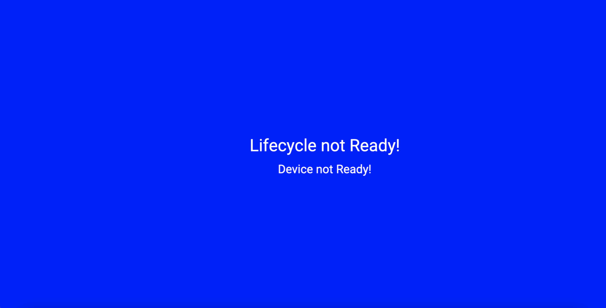
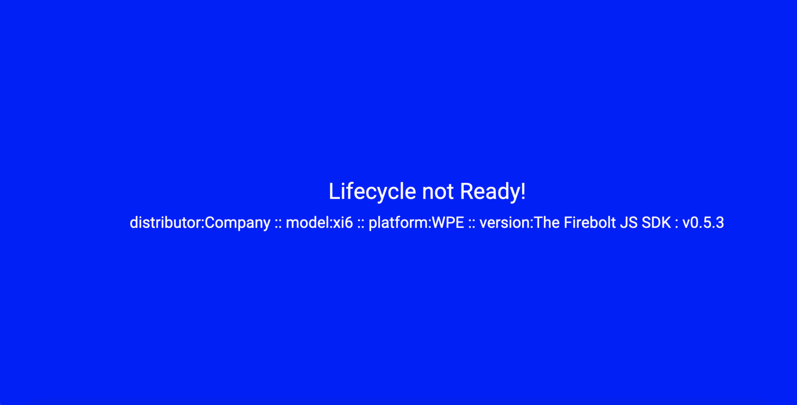

# Hello World Guide

In this practical guide, you'll learn how to get up and running so you can build a simple single-page app using Firebolt®. This guide will show you fundamentals like importing modules and how to use the Device and Lifecycle modules.

The *\"Hello World\"* guide is designed with the following assumptions:

-   You have some experience with the basics of programming (building apps, working with APIs, etc.) and have some experience working with the JavaScript programming language. This guide does not explain object-oriented programming or the JavaScript language.

-   You know what a "Single-Page App" is and how they work.

-   You understand JavaScript runtime tools like Node and NPM.

-   You understand how to install and use JavaScript packages on your local machine.

## What you'll need

- A computer running Windows or Linux, or a Mac running macOS.

- Internet access or an alternative way of loading the latest Firebolt® SDK and Lightning™ JavaScript framework onto your computer.

- Install Lightning™. No prior knowledge of Lightning™ is required, but it is a required dependency for this project.
  1. Using your machine's command-line interface (CLI), input the command:

      ```
      npm install -g @lightningjs/cli
      ```

  2. For more detail on installing Lightning™ go here:

     >  https://lightningjs.io/docs/#/getting-started/index

- Ensure you have some package manager like NPM or YARN.

  - For further instructions go here [Prerequisites](./prerequisites.md)


## What you'll learn

-   How to import Firebolt® modules.
-   How to register your Firebolt® events for the Lifecycle & Device modules.

## What you'll do

-   Install the necessary dependencies for this tutorial.
-   Create a blank project using Lightning, which is the UX framework this guide uses.
-   Install the Firebolt® SDK, allowing you to build a Firebolt® App.
-   Generate and build your app in a browser.
-   Explore and view the app you've built.

# App Overview

After successfully installing Lighting Studio, get Firebolt® up and running and create your app. At the end of all that, your finished app should look something like this:


# Getting Started - Install Lightning & Firebolt®

### Step 1: Clone the Hello World Github repo

1. Using any method you prefer, `git clone` or the Github desktop client, or a third way, use the URL https://github.com/rdkcentral/firebolt-hello-world and clone the *Hello World* repo.

   ```
   git clone https://github.com/rdkcentral/firebolt-hello-world.git
   ```

   

2. Open your command-line interface (CLI) tool and change your directory to the repo you just cloned.

   ```
   cd firebolt-hello-world/pt1-firebolt_hello_world-start
   ```

3. With CLI in the \"hello_world\" directory, run the command. This will install the `package.json` file and any other dependencies.

   ```
   npm install
   ```

4. **Optional:** Depending on your machine, you may need to install what is called `pug`, which is an HTML pre-processor. If you're curious and want to learn more, go here <https://www.sitepoint.com/a-beginners-guide-to-pug>. In the meantime, run the command `npm install pug`. If step 4 continues to show up as an error or you see something like `Error: Cannot find module 'pug'`, then run the above command.

5. In your CLI, use the commands

   ```
   npm run build
   npm run dev
   ```

This will build the `package.json` file in the directory and compile it with all the assets, including a source map. Ideally, making it easier to check for errors. After you've run `npm run build` & `npm run dev`, your default browser should pop up, and you should see,



### Step 2: Install the Firebolt® SDK

1.  In the CLI use the command use the command

        npm install @firebolt-js/sdk

1.  Once that's done, use the same commands as above

        npm run build
        npm run dev

### Step 3: Import the Device and Lifecycle Modules from Firebolt®

1. Navigate to the *Hello World* repo you downloaded and open `firebolt-hello-world/pt1-firebolt_hello_world-start/src/App.js`. Within the `App.js` file, add the following line of code right below the other import(s) to add the modules **Device** and **Lifecycle** to your app:

```javascript
import { Lifecycle, Device } from '@firebolt-js/sdk';
```

### Step 4: Add some functionality to your app

1. While still in the `App.js` file, go to the following line:

```javascript
{...
  _active() {
  }
}
```

Note that the `_active()` method is how the Lightning™ framework initiates your app and is not part of Firebolt®.

2. After `_active() {`, is where you put your Firebolt® code! Add the following Firebolt® code on a new line:

```javascript
Device.distributor()
.then(distributor => {
  const deviceDistributor = 'distributor:' + distributor;
  this.tag('Device').text.text = deviceDistributor + ' :: ';
});

Device.model()
.then(model => {
  const deviceModel = 'model:' + model;
  this.tag('Device').text.text += deviceModel + ' :: ';
});

Device.platform()
.then(platform => {
  const devicePlatform = 'platform:' + platform;
  this.tag('Device').text.text += devicePlatform + ' :: ';
});

Device.version()
.then(version => {
  const deviceVersion = 'version:' + version.sdk.readable + ' : v' + version.sdk.major + '.' + version.sdk.minor + '.' + version.sdk.patch;
  this.tag('Device').text.text += deviceVersion;
});  
```

This will append the `Device` text field with the appropriate `firebolt Device` information and show it on your screen. This is also the module you'd use to check details such as device IDs and manufacturer makes and models.

3. Refresh your browser, and you should now see
       


### Step 4: Listening for events

Let's add the Lifecycle event listeners to your app. This will allow it to respond to the various Lifecycle states an app may go through.

For more information on listening to events, please reference the API documentation:

> https://developer.comcast.com/firebolt/core/sdk/latest/docs/listening-for-events/

1. In the `App.js` file, add the following code at the same level as `_active()` and `_init()`:

```javascript
_registerLifecycleCallbacks() {
  Lifecycle.listen((event, value) => {
    console.log('Lifecycle.listen:', event, value);

    if (value.state) {
      console.log('Lifecycle: >> : previous state :' + value.previous, value);
      console.log('Lifecycle: >> : current state :' + value.state, value);
    }

    if (value.state == 'foreground') {
      console.log('Lifecycle : Foreground State');
      this.tag('HelloWorld').color = LifecycleColors.FOREGROUND;
      this.tag('Lifecycle').text.text = 'Lifecycle : Foreground State';
      this.tag('Complete').visible = true;
    }
    if (value.state == 'inactive') {
      console.log('Lifecycle : Inactive State');
      this.tag('HelloWorld').color = LifecycleColors.INACTIVE;
      this.tag('Lifecycle').text.text = 'Lifecycle : Inactive State';
    }
    if (value.state == 'background') {
      console.log('Lifecycle : Background State');
      this.tag('HelloWorld').color = LifecycleColors.BACKGROUND;
      this.tag('Lifecycle').text.text = 'Lifecycle : Background State';
    }
  });
}
```

Using the functions you've added we're going to call `_registerLifecycleCallbacks` in the `_active()` function. By adding the following code within the `_active()`, your app will register Lifecycle events and inform Firebolt® when your app is ready to launch, also known as `'Lifecycle.ready'`

2. Next, add the following code to the `_active()` function.

```javascript
this._registerLifecycleCallbacks();
Lifecycle.ready();
```

3. Now refresh your browser, and your app should display the following:

> The Lifecycle state and background color change to reflect the transitions to the 'Foreground' state


The Lifecycle state and background color change to reflect the transitions to the `Foreground` state.

You're almost finished! Right now, your app is running in the mock transport layer provided by the Firebolt® SDK. That means you can test your app and the Firebolt® API, but static pre-determined values will be returned. They won't change based on your input. It's a good sanity check but not particularly robust. However, if you'd like to test your app and see dynamic values, you can use Firebolts Mock application.

## Using the Firebolt Mock Application

For a more in-depth overview of how to set up Mock Firebolt, read our setup guide here: [How to use Mock Firebolt](./how-to-use-mock-firebolt.md)

To use Firebolt's mock application, repeat all the steps above but make these changes.

1. In [Step 1](#step-1---clone-the-hello-world-github-repo). Clone the https://github.com/rdkcentral/mock-firebolt repository instead of the one provided. This contains the dependencies that allow your app to connect to Mock Firebolt.

   ```
   git clone https://github.com/rdkcentral/mock-firebolt
   ```

2. In Step 1.2 change the directory to reflect the newly cloned repo.

   ```
   cd pt3-Firebolt_hello_world-mock
   ```

3. Follow the rest of the steps as written above. With your browser open, append `?mf=true` to the end of the URL above.


### Connect Hello World with Mock Firebolt

1.  Open a new window/tab in your command-line interface (CLI) tool and change the directory to `cd [filepath]\mock-firebolt-os`, then run

        cd server

*You should still have another CLI window open to the Hello World repo.*

2. Run these commands in the order below

```
npm install
npm run clean
npm run build:core
npm run build:mf
```

3 . In the same CLI window, run the command

```
npm run dev
```

Now mock OS is up and running.

4. Open a new CLI window and type in the command

```
cd cli
npm install
```

5. Change the directory to

```
cd src
```

Now you can modify the Hello World Firebolt® app using the CLI.

### Example: Changing the distributor from *Company* to *Videos R US*

In the CLI window where you're current directory is `$ src %` use the command:

    node cli.mjs --upload ../examples/device-distributor-1.json

Refresh your browser, and you'll see the distributor go from `distributor: Company` to `distributor: Videos R Us`.


## Hello World Examples - Let's play

**Change the device model**

To change the model of the device from `model: xi6` to say `xi3000` use the command:

````
node cli.mjs --upload
````

**Change your app's Lifecycle**

To send events such as methods, result keys, etc., use the command:

````
node cli.mjs --event
````

To change the lifecycle, use the command above along with an example file path and a lifecycle `.json` file to change the state of the "Hello World App".

    node cli.mjs --event ../examples/lifecycle-initializing-to-inactive.event.json


As an example going from inactive to the foreground state would be

    node cli.mjs --event ../examples/../examples/lifecycle-inactive-to-foreground.event.json

# Conclusion

*Congratulations*, you did it! You made your very first Firebolt® app!

Now you know how to:

1.  Install Firebolt® onto your device

2.  Import Firebolt® modules

3.  Use the Device module to get the device information your app is running on

4.  Use the Lifecycle module to ensure your app is ready to run.

To continue learning more about Firebolt®, check out our [API](https://developer.comcast.com/firebolt/core/sdk/latest/api/) docs and guides.
